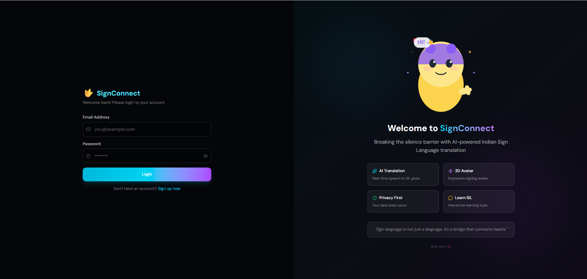
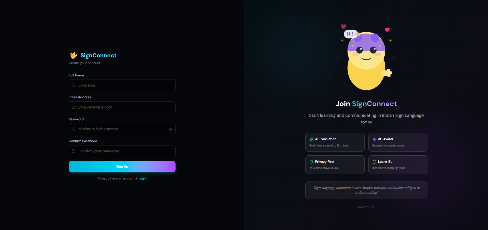
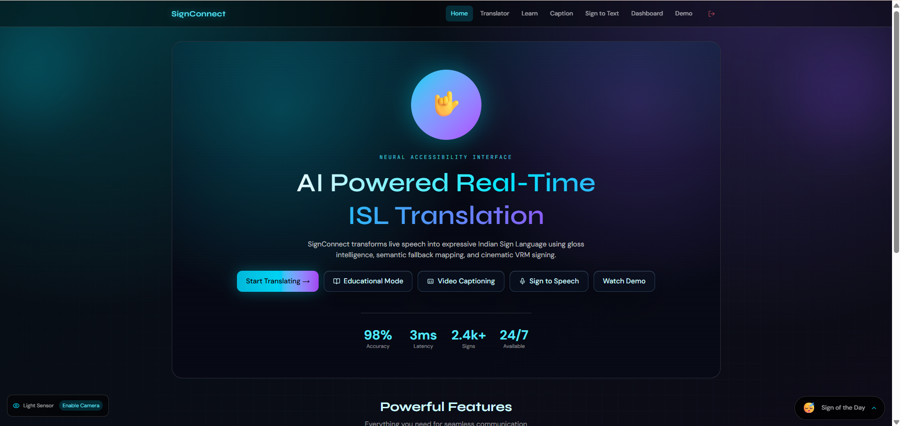
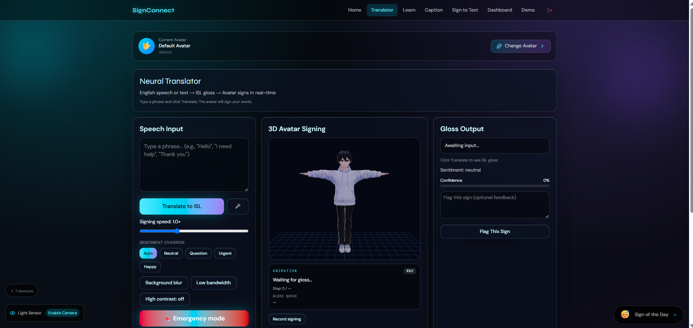
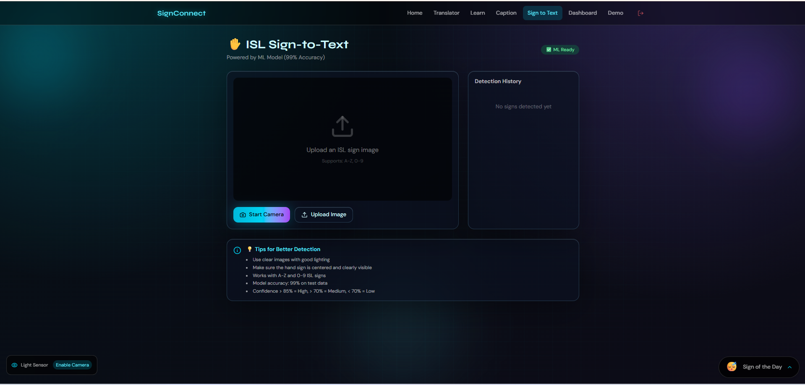
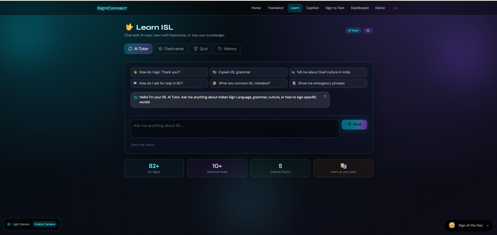
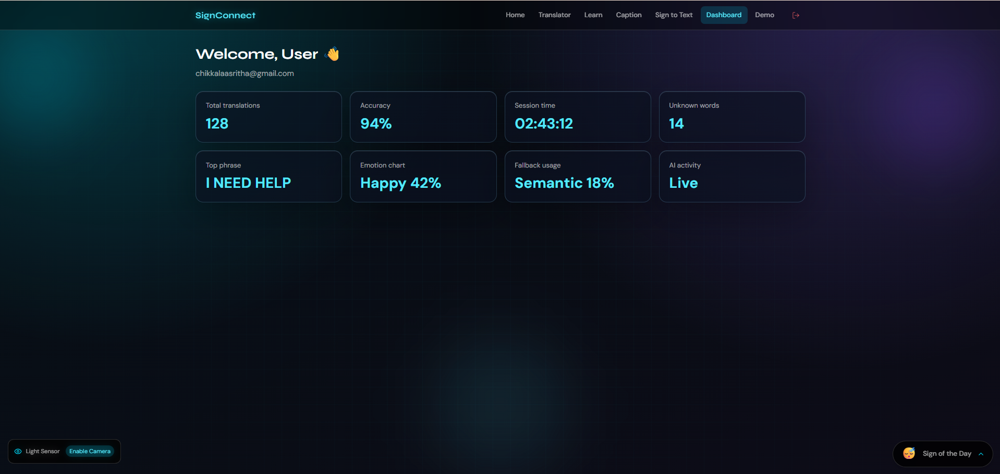
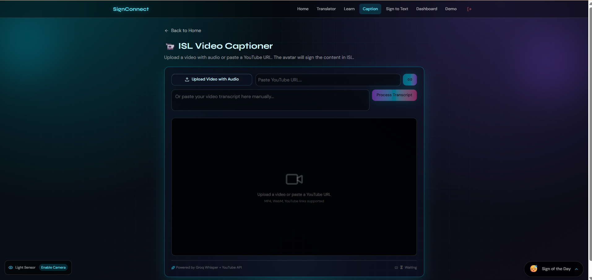

# 🚀 SignConnect - AI-Powered Indian Sign Language Accessibility Platform


> Breaking communication barriers with AI-powered Indian Sign Language translation, real-time 3D avatar signing, sign recognition, and AI-assisted learning.


---

# 📑 Table of Contents
1. Problem
2. Objective
3. Team
4. Tech Stack
5. Architecture
6. Features
7. Screenshots
8. Installation
9. Environment Variables
10. Future Scope
11. Resources
12. Acknowledgements

---

# 📌 Problem & Domain

India has more than **5 million Deaf and Hard-of-Hearing individuals**, while the number of certified Indian Sign Language interpreters remains extremely limited. This creates communication barriers in education, healthcare, workplaces, banking, and government services.

**Themes Selected:**
- [x] **Human Experience & Productivity** – Accessibility solution improving quality of life for 5M+ deaf individuals
- [x] **Learning & Knowledge Systems** – AI-powered ISL education platform with AI Tutor, flashcards, and quizzes
- [x] **HealthTech & Bio Platforms** – Healthcare communication for deaf patients and emergency response tools
- [x] **Developer Tools & Software Infrastructure** – Full-stack Next.js app with TensorFlow ML, Neo4j graph database, and multiple API integrations

---

## Why These Themes?

| Theme | How SignConnect Fits |
|-------|---------------------|
| **Human Experience & Productivity** | Real-time ISL translation, 3D avatar signing, and gesture shortcuts for daily communication |
| **Learning & Knowledge Systems** | AI Tutor, flashcards, interactive quizzes, and chat history for ISL learning |
| **HealthTech & Bio Platforms** | Emergency mode, hospital/pharmacy locator, and doctor-patient communication |
| **Developer Tools & Software Infrastructure** | Next.js API routes, TensorFlow CNN (99.17% accuracy), Neo4j AuraDB, and Render deployment |

---

# 🎯 Objective

## Target Users
- Deaf community
- Hard-of-hearing individuals
- Families
- ISL learners
- Teachers
- Doctors
- Public service providers

## Solution
SignConnect is a complete accessibility platform providing:

- Speech → ISL
- Text → ISL
- Sign → Text
- AI Tutor
- Video Captioning
- Learning Platform

---

# 👥 Team

## Team Name
Vector Vortex

### Members

- Chikkala Asritha — Full Stack Developer, AI/ML
- Merikela Geeta Sanjana — UI/UX & Testing

---

# 🛠 Tech Stack

## Frontend
- Next.js 16
- React 19
- TypeScript
- Tailwind CSS
- Framer Motion
- Three.js
- React Three Fiber
- VRM

## Backend
- Next.js API Routes
- Supabase

## Database
- PostgreSQL
- Neo4j AuraDB

## AI
- Sarvaam AI
- Groq AI
- Groq Whisper
- TensorFlow
- MobileNetV2
- Keras

## Hosting
- Render

---


# 🏆 Sponsored Tracks

Our project participates in the following sponsored tracks:

- [x] **Neo4j Track** – Uses Neo4j AuraDB as the graph database
- [x] **Base44 Track** – Used for rapid prototyping and UI iteration
- [x] **Sarvaam AI Track** – AI-powered English to ISL Gloss translation
- [x] **Render Workflows Track** – Automated deployment and CI/CD


---

# 🤝 How We Used the Partner Technologies

## 🔷 Neo4j Track

SignConnect uses **Neo4j AuraDB** as a graph database to represent Indian Sign Language (ISL) signs and their semantic relationships.

Instead of storing isolated records, each sign is represented as a node connected to related signs, categories, and learning paths. This enables:

- 🔍 Semantic sign lookup
- 📚 Intelligent learning recommendations
- ⚡ Faster fallback suggestions when AI translation is unavailable
- 🧠 Relationship-based ISL knowledge representation


## 🤖 Sarvaam AI Track

Sarvaam AI serves as the **primary translation engine** for converting English sentences into **Indian Sign Language Gloss**.
The generated gloss is then animated using our 3D VRM avatar.

### Translation Flow

```
English Input
      │
      ▼
 Sarvaam AI
      │
      ▼
  ISL Gloss
      │
      ▼
 3D Avatar Animation
```


---

## 🚀 Render Workflows Track

The entire SignConnect platform is deployed on **Render**.

We use Render's GitHub integration to automate deployment and CI/CD.

### Render Features Used

- ✅ Automatic deployment from GitHub
- ✅ Environment variable management
- ✅ Continuous Integration & Continuous Deployment
- ✅ Secure HTTPS hosting
- ✅ Production-ready backend hosting

**Live Application**

👉 https://signconnect-qvx7.onrender.com

---

## 🟣 Base44 Track

Base44 was used during the initial stages of development to rapidly prototype the SignConnect user interface and validate accessibility-focused workflows.

This enabled our team to:

- Design user flows quickly
- Validate accessibility features
- Iterate on the interface with minimal development overhead
- Refine the user experience before implementation

---

## 🌟 Impact of Partner Technologies

| Partner | Contribution |
|----------|--------------|
| **Neo4j AuraDB** | Graph-based ISL knowledge representation |
| **Sarvaam AI** | English → ISL Gloss translation |
| **Groq AI** | High-speed AI inference and translation fallback |
| **Render** | Deployment, hosting, and CI/CD |
| **Base44** | Rapid prototyping and UI validation |

---


## ✨ Key Features

### 🗣️ Speech-to-ISL Translator
- ✅ Speech Input - Convert English speech to text
- ✅ Text Input - Type text for translation
- ✅ ISL Gloss Translation - Sarvaam AI / Groq AI
- ✅ 3D VRM Avatar - Realistic avatar signs in real-time
- ✅ Sentiment Detection - Happy, urgent, question, neutral
- ✅ Emergency Mode - Urgent signing with visual alerts
- ✅ Learning Tools - Slow-mo, mirror mode
- ✅ Avatar Selector - Multiple VRM avatar styles
- ✅ **Gesture Shortcuts** - Smart actions for everyday needs
- ✅ Session Logging - Track translation history
### ⚡ Gesture Shortcuts - Smart Actions

SignConnect detects specific words and triggers smart actions automatically:

| Say/Sign | Action |
|----------|--------|
| **HOSPITAL** | Opens Google Maps with nearby hospitals (confirmation required) |
| **POLICE** | Opens Google Maps with nearby police stations (confirmation required) |
| **HELP** | Shows emergency alert with contact information |
| **EMERGENCY** | Shows emergency alert with 112 contact |
| **PHONE** | Copies emergency number 112 to clipboard |
| **LOCATION** | Shares your current location (confirmation required) |
| **LIGHT** | Toggles device flashlight ON/OFF (mobile only) |


> 💡 *Example: Type "hospital" and click Execute → Opens Google Maps with hospitals near you!*

### ✋ Sign-to-Text with 99% Accuracy
- ✅ ML Model - Custom CNN with 99.17% accuracy
- ✅ Dataset - 5,400+ ISL images (A-Z, 0-9)
- ✅ Camera Integration - Real-time sign detection
- ✅ Confidence Scoring - Shows prediction confidence
- ✅ History Tracking - Tracks all detections
- ✅ Top Predictions - Shows top 3 predictions

### 🤖 AI-Powered ISL Learning
- ✅ AI Tutor - Chat with Sarvaam AI / Groq AI
- ✅ Flashcards - Learn ISL signs with flip animations
- ✅ Interactive Quiz - Test your ISL knowledge
- ✅ Chat History - View all previous conversations
- ✅ Document Upload - Upload documents for context

### 🎥 Video Captioning
- ✅ Video Upload - Upload videos with audio
- ✅ YouTube Support - Paste YouTube URL
- ✅ Whisper Transcription - Groq Whisper for speech-to-text
- ✅ Avatar Signing - Avatar signs the transcript in ISL
- ✅ Manual Input - Paste transcript manually

### 👤 User Dashboard
- ✅ Authentication - Supabase email/password auth
- ✅ Profile Management - View and manage account
- ✅ Learning Progress - Track your journey
- ✅ Sign of the Day - Daily ISL sign widget

### 🎯 Demo & Navigation
- ✅ Demo Mode - Auto-play demonstration
- ✅ Responsive Navigation - Desktop and mobile
- ✅ Low Light Detector - Automatic brightness adjustment
# 📸 Screenshots


| Login | Signup |
|-------------|-----------|
|  |  |

| Home | Translator |
|------|------------|
|  |  |

| Recognition | AI Tutor |
|-------------|-----------|
|  |  |

| Dashboard | Video Captioning |
|-------------|-----------|
|  |  |

---


# 🚀 Installation

```bash
git clone https://github.com/asritha-chikkala/SignConnect.git

cd SignConnect

npm install

cp .env.example .env.local

npm run dev
```

---

# 🔐 Environment Variables

```env
NEXT_PUBLIC_SUPABASE_URL=
NEXT_PUBLIC_SUPABASE_ANON_KEY=
SARVAAM_API_KEY=
GROQ_API_KEY=
NEO4J_URI=
NEO4J_USERNAME=
NEO4J_PASSWORD=
NEXT_PUBLIC_APP_URL=
```

---

# 📈 Model Performance

| Model | Accuracy |
|--------|---------:|
| MobileNetV2 CNN | 99.17% |

Dataset:
- ISLRTC
- 5400+ Images
- A-Z
- 0-9

---

# 📽️ Demo & Deliverables

- **Demo Video Link (Mandatory):** [https://youtu.be/your-video-link](https://youtu.be/your-video-link)
- **Deployment Link (Recommended):** [https://signconnect-qvx7.onrender.com](https://signconnect-qvx7.onrender.com)
- **GitHub Repository:** [https://github.com/asritha-chikkala/SignConnect](https://github.com/asritha-chikkala/SignConnect)
- **Pitch Deck / PPT (Optional):** [Paste link]

---


## 🎯 Quick Access

```bash
# Live Demo
https://signconnect-qvx7.onrender.com

# GitHub Repository
https://github.com/asritha-chikkala/SignConnect

# 🧬 Future Scope

- Word-level Recognition
- Sentence Translation
- Android App
- iOS App
- Offline AI
- AR Glasses
- Regional Languages
- Larger Vocabulary
- Expo App

---

# 🙏 Acknowledgements

- HackHazards '26
- Sarvaam AI
- Neo4j
- Supabase
- Render
- TensorFlow
- Three.js
- ISLRTC

---

# ❤️ Final Words

Technology should be accessible to everyone.

SignConnect demonstrates how AI, Computer Vision, and 3D graphics can help bridge communication gaps and empower the Deaf community through inclusive technology.

**Made with ❤️ by Team Vector Vortex**
